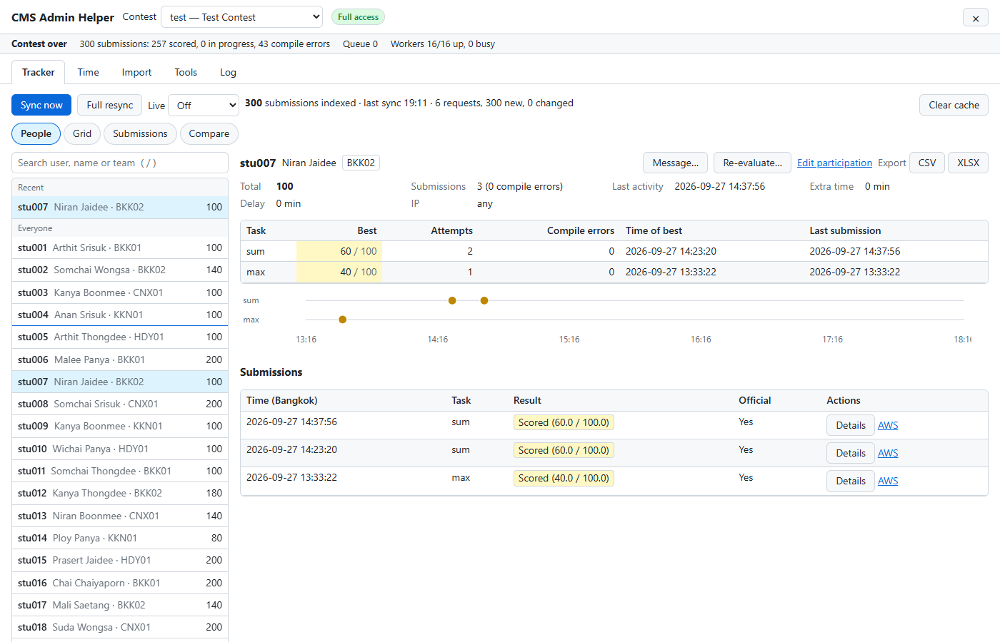
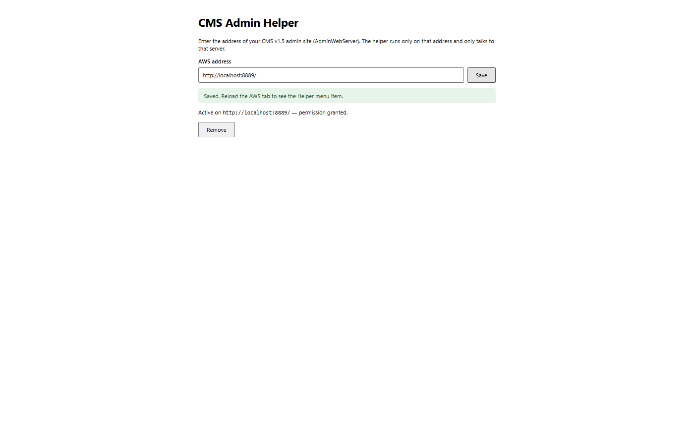
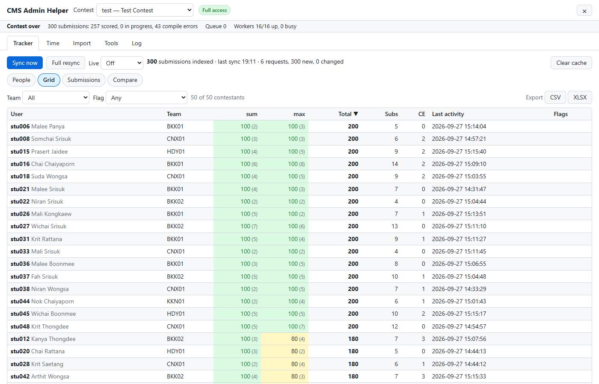
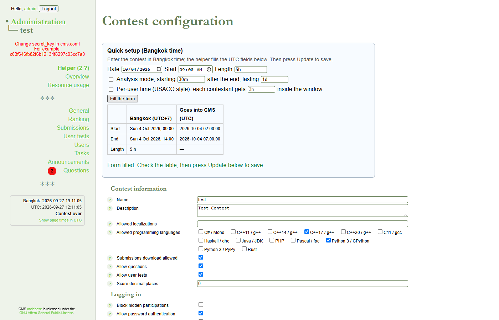
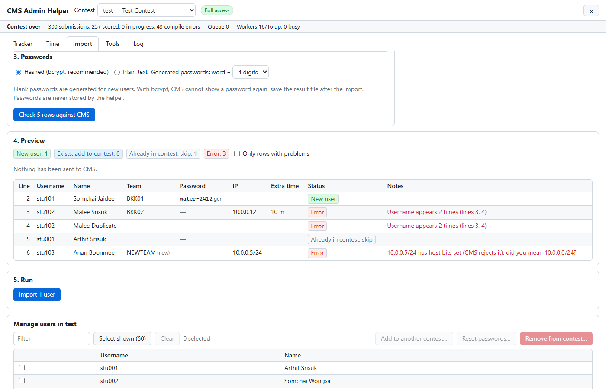
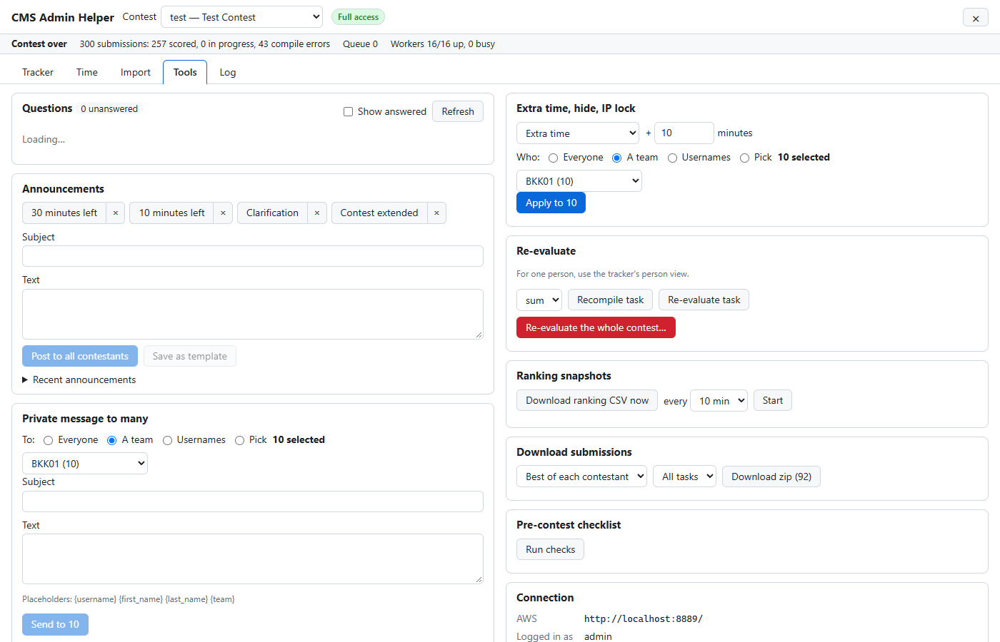

# CMS Admin Helper

A Chrome and Firefox extension that adds the tools contest admins miss to the admin site (AdminWebServer, "AWS") of
[CMS v1.5](https://github.com/cms-dev/cms/tree/v1.5). It needs **no change to the CMS server**: it reads the admin pages and
submits the same forms an admin would, with the admin's own logged-in session, and it talks to no other server.



## What it does

- **Tracker** — everything one contestant did on one screen: best score per task, attempts, time of best, compile errors, a
  timeline, every submission with testcase results and source. Plus a contest grid with flags (*no submission in 30 min*,
  *many compile errors*, *still 0 after 5 tries*), filters, compare 2–4 contestants, and CSV/XLSX export. On AWS's own
  submission lists you get a filter bar, "only" links and score cards when you hover a username.
- **Bangkok time** — enter contest times in Bangkok time (or any timezone you choose) and the extension fills the UTC fields
  AWS wants, with a summary before you save and warnings for mistakes (end before start, start already passed, a 29-hour
  contest, empty timezone). Times on AWS pages are shown in Bangkok time with UTC on hover; duration fields accept `1h 30m`.
- **Bulk import** — paste from Excel or Google Sheets, or load a CSV/XLSX file: the extension checks every row, creates teams,
  users and participations (with IP, extra time, hidden/unrestricted), and gives you a result file and printable login cards.
  Also: generate users from a pattern (`stu{001..120}`), add users to another contest, remove them, reset passwords.
- **Contest-day tools** — live status (countdown, submissions by state, queue, workers), questions inbox with a badge and
  desktop notifications, announcement templates, bulk extra time, bulk private messages with `{first_name}` placeholders, IP
  lock from a seat map, re-evaluate a task or the whole contest, ranking snapshots on a timer, zip of final submissions, and a
  pre-contest checklist.
- **Audit log** — every change the extension makes in CMS, with time, targets and result; exportable as CSV.

## Install

Download the release zip for your browser.

**Chrome / Edge**

1. Unzip `cms-admin-helper-<version>-chrome.zip`.
2. Open `chrome://extensions`, turn on **Developer mode**, click **Load unpacked** and choose the unzipped folder.

**Firefox** (version 140 or newer)

- Install the signed `.xpi` from the release page (unlisted add-on, signed by Mozilla).
- For testing only: `about:debugging` → **This Firefox** → **Load Temporary Add-on** → choose `manifest.json` inside the
  unzipped `cms-admin-helper-<version>-firefox.zip`. It is removed when Firefox closes.

## Set up



1. Click the extension's toolbar button (or open its options).
2. Enter the address of your AWS, for example `http://10.0.0.5:8889`, and press **Save**.
3. Allow access when the browser asks. The extension asks for **that one address only** and runs nowhere else.
4. Reload the AWS tab. A **Helper** item appears at the top of the AWS menu.

Log in to AWS as usual; the extension uses that session. What you can do in the helper follows your AWS permissions: a
read-only admin can look at everything, but every button that changes CMS is disabled.

## Using it

Click **Helper** in the AWS menu (Esc closes it). The contest picker at the top starts on the contest of the page you are on.

### Tracker

The first time you open a contest, the helper reads all its submission pages once (about 15 seconds for 2,000 submissions).
After that **Sync now** usually needs a single request; **Live** re-syncs every 15–60 seconds while the helper is open.

- **People** — search by username, name or team (press `/` to jump to the search box). Click a name to see their score
  matrix, timeline and submissions; click a task row to see only that task. **Details** shows testcase results, compilation
  output and the source. **Message…**, **Re-evaluate…** and **Edit participation** act on that contestant.
- **Grid** — every contestant × task, sortable, with flags; click a row to open that person.
- **Submissions** — filter by users, team, task, status, score range, time window (in your timezone) or *improved score only*.
- **Compare** — tick 2 to 4 contestants.
- **Export** — CSV or XLSX of what you are looking at.



### Contest times

On the contest's **General** page, the **Quick setup** card takes a date, a start time and a length in Bangkok time and fills
*Start*, *End*, *Timezone* (and optionally the analysis window or per-user time) in the form below. Check the table, then press
AWS's **Update** as usual. Every UTC field also gets a Bangkok-time picker beside it.



The sidebar clock shows Bangkok time, UTC and "starts in / ends in", and warns if your computer's clock differs from the
server's by more than a minute. The **Time** tab converts in both directions and lets you change the display timezone.

### Bulk import

1. **Import** tab → paste rows or choose a CSV/XLSX file. Only `username` is required. Columns:
   `username, first_name, last_name, password, email, team, ip, hidden, unrestricted, extra_time, timezone, languages`.
   Headers are matched loosely (e.g. *User*, *ชื่อผู้ใช้*, *E-mail*), and you can change the mapping.
2. Choose how passwords are stored (bcrypt recommended). Blank passwords are generated, like `tiger-4821`.
3. **Check against CMS** — every row gets a status: *New user*, *Exists: add to contest*, *Already in contest: skip* or
   *Error* (duplicate, bad characters, invalid IP or subnet, bad timezone …). Nothing is sent yet.
4. **Import** — you can pause or cancel; failed rows show AWS's reason and can be retried. Running the same file again changes
   nothing.
5. **Save the results file** (the only place the new passwords exist) and **print login cards** (A4, 8 or 10 per page).



**Manage users** below the import lets you select contestants and add them to another contest, reset their passwords, or
remove them from the contest (this deletes their submissions in that contest; you must type `REMOVE` to confirm).

### Contest-day tools

The **Tools** tab: questions inbox (with quick answers), announcements from templates, private messages to many contestants,
extra time / hidden / unrestricted for a team or a list, IP lock from a `username,ip` seat map, re-evaluation of a task or the
whole contest, ranking CSV snapshots every few minutes, a zip of each contestant's best or last submission, and a pre-contest
checklist. The status bar under the header shows the countdown, submissions by state, the evaluation queue and workers.



## Safety

- **Only your CMS.** No analytics, no remote code, no other server: every library is bundled, and the extension only has
  access to the AWS address you entered.
- **Passwords are never stored**, neither the admin's nor contestants'. Generated passwords live in memory until you download
  the results file.
- **Careful writes.** Destructive actions show exactly what will happen and need a typed confirmation. Editing a participation
  reads the current form and sends every field back unchanged except the one you change. Every change is checked against what
  AWS shows afterwards and recorded in the audit log (**Log** tab).
- **Gentle on AWS.** At most 2 requests at once and 4 per second, with back-off when the server struggles; the in-flight limit
  holds across all AWS tabs. Measured AWS response times while a stress test, a full sync and a 300-user import ran together:
  median 171 ms, 95% under 650 ms, no errors (details in [docs/testing.md](docs/testing.md)).
- **Version guard.** If the pages do not look like CMS v1.5, the helper switches to read-only and says what did not match.
- A warning appears if AWS is reached over plain `http://` at a public address.

What is kept in the browser: the AWS address, display settings, announcement templates, the audit log, and the tracker's
copy of the submission list (per AWS address and contest; **Clear cache** removes it).

## Known limits

- CMS v1.5 only; other versions open read-only. English interface only.
- The tracker cache is per browser: each admin syncs their own copy.
- Question notifications, live sync and ranking snapshots run only while an AWS tab is open.
- Firefox 140+; recent Chrome/Edge (tested with Chromium 153).

## Development

```bash
pnpm install
pnpm dev             # Chrome with the extension, auto-reload
pnpm dev:firefox
pnpm check           # typecheck, unit tests, Chrome + Firefox builds
pnpm test:e2e        # end-to-end tests against a local CMS v1.5
pnpm zip             # release zips in .output/
```

- [docs/dev-server.md](docs/dev-server.md) — a local CMS v1.5 with test data (Docker).
- [docs/testing.md](docs/testing.md) — unit, end-to-end, Firefox and load testing.

Built with [WXT](https://wxt.dev) (Manifest V3), TypeScript, Preact, PapaParse, SheetJS and fflate.

### Releasing

1. Bump `version` in `package.json`, then `pnpm check && pnpm test:e2e`.
2. `pnpm zip` → `.output/cms-admin-helper-<version>-chrome.zip`, `-firefox.zip` and `-sources.zip`.
3. Sign the Firefox build as an unlisted add-on with your AMO API credentials
   ([addons.mozilla.org/developers/addon/api/key](https://addons.mozilla.org/developers/addon/api/key/)):

   ```bash
   pnpm exec web-ext sign --channel unlisted --source-dir .output/firefox-mv3 \
     --api-key "$AMO_JWT_ISSUER" --api-secret "$AMO_JWT_SECRET"
   ```

   Upload `-sources.zip` if AMO asks for the source code. `web-ext lint` shows two warnings inside Preact's renderer
   (`innerHTML` in its `dangerouslySetInnerHTML` path, which this extension never uses).
4. Attach the Chrome zip and the signed `.xpi` to the release.
